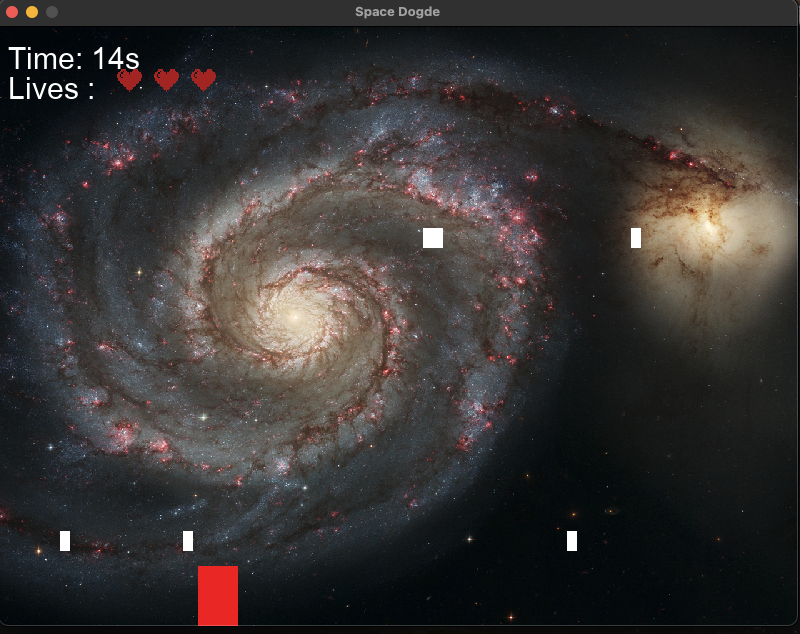
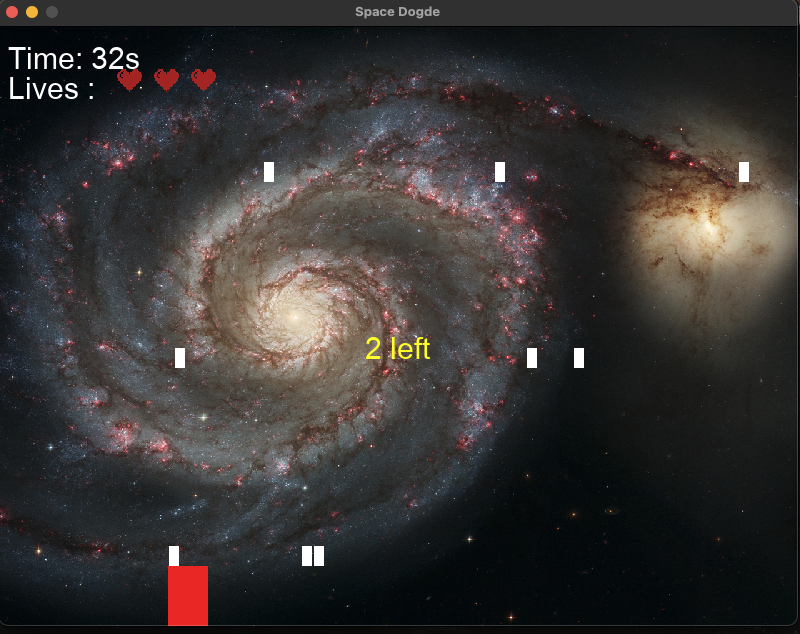
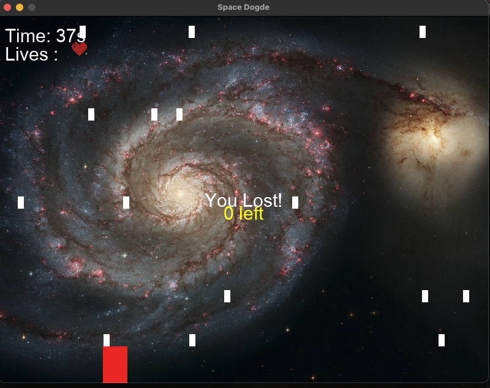

# 🚀 Space Dodge

A simple yet exciting space-themed dodge game built with **Python** and **Pygame**.

## How to Play
- Use the left and right arrow keys to move your red spaceship.  
- Avoid the falling white obstacles.  
- You have 3 lives — when they are gone, the game ends.  
- Try to survive as long as possible; your time will be displayed on the screen.

## Features
- Real-time collision detection  
- Life tracking system with heart icons  
- Dynamic falling obstacles  
- Galaxy background image for a cosmic atmosphere 🌌  

## Technologies Used
- Python 3.9  
- Pygame 2.6.1  

## Screenshots

### 1️⃣ Main Gameplay  
The main screen of the game where you control your red spaceship and dodge the falling obstacles.  


### 2️⃣ Losing a Life  
When you hit an obstacle, you lose one heart — the remaining number of lives is displayed on the screen.  


### 3️⃣ Game Over Screen  
When all lives are gone, the game ends and “Game Over” text appears on the screen.  



## How to Run
1. Make sure Python is installed on your computer.  
2. Install Pygame using:  
   ```bash
   pip install pygame
Mac users: If pip doesn’t work, try pip3 install pygame
